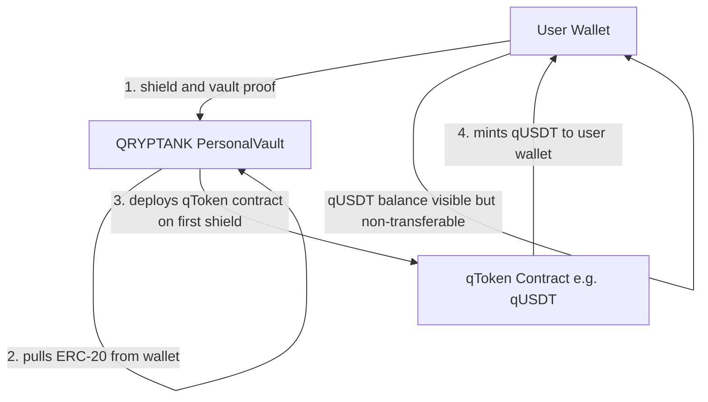
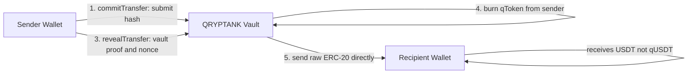

# Qryptum

**Non-custodial, post-quantum ready token shielding protocol on Ethereum.**

Qryptum lets you shield any ERC-20 token into your own personal QRYPTANK vault.
Each QRYPTANK is a smart contract you alone control, protected by a 6-character
cryptographic vault proof. Shielded tokens become qTokens (e.g. qUSDT, qETH):
non-transferable at the contract level and impossible to move without both your
private key and your vault proof simultaneously.

No pool. No custody. No admin keys. Your tokens never leave your own vault contract.

## What makes it different

| Feature | Detail |
|---|---|
| Full self-custody | Your vault is your own smart contract. Qryptum holds nothing and has zero admin access. |
| Non-transferable qTokens | qToken transfer(), transferFrom(), and approve() always revert at contract level. Not just a UI restriction. |
| Commit-reveal transfers | Two-step transfer hides recipient and amount until reveal, protecting against front-running. |
| Vault proof protection | All vault operations require your cryptographic vault proof verified on-chain via keccak256. |
| Post-quantum design | Vault proof architecture designed with quantum-resistant access patterns in mind. |
| No shared pool | Every user gets one isolated vault contract for life. Funds are never commingled. |

## How shielding works

## How shielded transfers work

The recipient always receives the original ERC-20 token, not qToken.
They can choose to shield it into their own QRYPTANK if they want.

## Security model

| Property | Detail |
|---|---|
| Vault model | Each user owns their personal vault contract. Qryptum holds nothing. |
| Admin access | Qryptum deployer has zero access to any user vault. No upgrade keys. No backdoors. |
| Vault proof | Raw proof sent in calldata, verified on-chain via keccak256. Safe because private key is still required. |
| Transfer safety | Requires private key and vault proof at the same time. Compromising one alone is not enough. |
| qToken design | Non-transferable permanently at Solidity level, not just in the UI. |

## Repositories

| Repo | Description | Stack |
|---|---|---|
| [contracts](https://github.com/Qryptumorg/contracts) | ShieldFactory, PersonalVault, ShieldToken | Solidity 0.8.24, Hardhat |
| [app](https://github.com/Qryptumorg/app) | Frontend dApp | React 19, Vite, wagmi, TypeScript |
| [api](https://github.com/Qryptumorg/api) | Backend API | Express, TypeScript, PostgreSQL |
| [db](https://github.com/Qryptumorg/db) | Database schema | Drizzle ORM, PostgreSQL |

## Status

Active development. Smart contracts complete with 83 passing test cases.
Sepolia testnet deployment in progress.

## License

Copyright (c) 2026 [wei-zuan](https://github.com/wei-zuan). MIT License.
