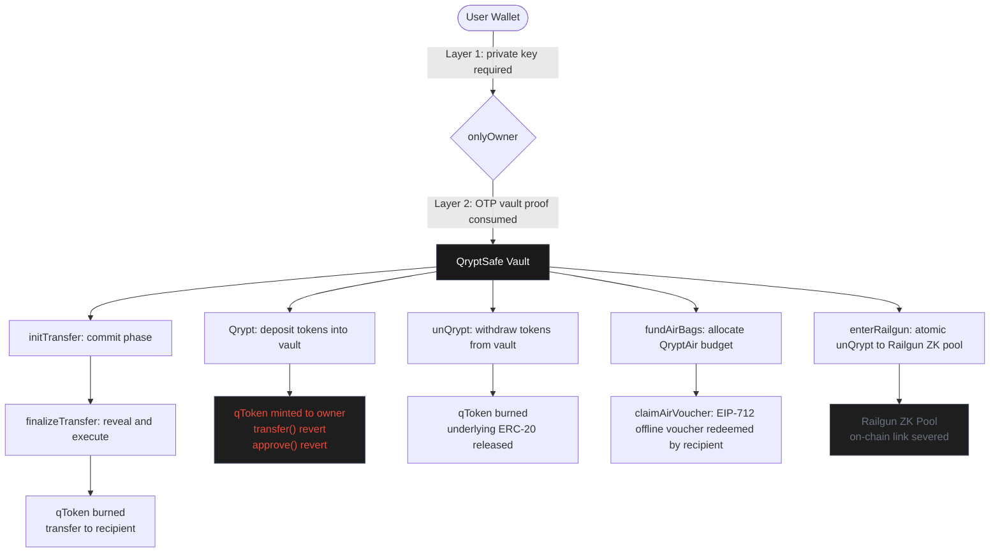

<h1 align="center">QRYPTUM</h1>

<h3 align="center">The Security Layer Beyond Your Private Key</h3>

  
  
  
  
  
  

  
  
  
  

  <picture>
    <source media="(prefers-color-scheme: dark)" srcset="https://raw.githubusercontent.com/Qryptumorg/.github/main/profile/banner.png" />
    <source media="(prefers-color-scheme: light)" srcset="https://raw.githubusercontent.com/Qryptumorg/.github/main/profile/banner-light.png" />
    
  </picture>

  <a href="https://qryptum.org">qryptum.org</a> ·
  <a href="https://qryptum.org/docs">docs</a> ·
  <a href="https://app.qryptum.org">app</a> ·
  <a href="https://github.com/Qryptumorg/contracts">contracts</a> 

---

## The Problem

Private key exposure is the single largest cause of crypto loss.
Phishing, malware, compromised seed phrases, social engineering: the
result is always the same. Once an attacker holds your private key,
every ERC-20 token in your wallet can be drained in seconds.

Qryptum eliminates this exposure without introducing a custodian.

---

## How It Works

### Private Key vs QryptSafe: Side by Side

Most crypto losses start with the same root cause: the private key is the only gate. QryptSafe adds an independent second layer that the private key cannot override.

| | Traditional EOA | QryptSafe Vault |
|---|---|---|
| **Security gate** | Private key only | Private key + OTP vault proof (both required) |
| **Key compromised** | Full drain in one `transfer()` | Attacker gains nothing - funds stay locked |
| **Token transfers** | `transfer()` works freely | `transfer()`, `transferFrom()`, `approve()` always revert on-chain |
| **Where funds live** | Wallet address (same as signing key) | Isolated vault contract per user, not the wallet |
| **Replay protection** | None | `proofChainHead` advances atomically - each OTP is single-use |
| **Privacy exit** | None | `enterRailgun` severs on-chain sender/recipient link |

### The Two Layers

Both must be defeated at the same time. Defeating either one alone accomplishes nothing.

| Layer | Mechanism | If broken alone |
|---|---|---|
| **Layer 1** | `onlyOwner` - ECDSA private key signature | Attacker still needs the vault OTP proof to move any funds |
| **Layer 2** | OTP chain - single-use keccak256, `proofChainHead` advances per call | Attacker still needs the private key to call any vault function |

---

## Products

### QryptSafe

Non-custodial vault contract. Tokens are held at the vault address, not
in the user's wallet. In place of real tokens, the owner receives
non-transferable qTokens (qUSDC, qWETH, etc.).

`transfer()`, `transferFrom()`, and `approve()` on all qTokens always
revert at the contract level. No wallet, exchange, or script can move
them. Draining a wallet private key yields nothing.

**Key functions:** `Qrypt` · `unQrypt` · `initTransfer` · `finalizeTransfer` · `rechargeChain` · `emergencyWithdraw`

---

### QryptAir

Offline EIP-712 signed vouchers. The vault owner signs a typed voucher
entirely offline. The signed voucher is shared with the recipient as a
QR code. The recipient broadcasts `claimAirVoucher` on-chain. The vault
verifies the signature and transfers funds directly to the recipient.

The signing key never touches a live network node during the signing
session.

**Key functions:** `fundAirBags` · `reclaimAirBags` · `claimAirVoucher`

---

### QryptShield

Atomic unQrypt-to-Railgun in a single transaction. Calls `enterRailgun`
to burn qTokens, approve the Railgun proxy, and shield into the Railgun
ZK privacy pool atomically. Zero-knowledge proofs cryptographically
sever the on-chain link between sender and recipient.

No Qryptum-owned contracts are involved in the Railgun layer. The
Railgun protocol handles all ZK logic.

**Key function:** `enterRailgun` · [Railgun on GitHub](https://github.com/Railgun-Community)

---

## Smart Contracts

### Sepolia Testnet (V6 - Active)

| Contract | Address |
|---|---|
| QryptSafeV6 (factory) | `0xeaa722e996888b662E71aBf63d08729c6B6802F4` |
| PersonalQryptSafeV6 (impl) | `0x3E03f768476a763A48f2E00B73e4dC69f9E8A7E3` |

All contracts are MIT-licensed and verified on Sepolia Etherscan.

[View all deployed addresses](https://github.com/Qryptumorg/contracts#sepolia-contract-addresses)

---

## Security Properties

| Property | Detail |
|---|---|
| Non-custodial | Tokens held at vault contract. Qryptum deployer has zero admin keys. |
| Non-transferable qTokens | `transfer()`, `transferFrom()`, `approve()` always revert on-chain. |
| Dual-factor | Every vault operation requires private key AND OTP vault proof simultaneously. |
| OTP chain replay protection | Each proof is single-use. `proofChainHead` advances atomically on every call. |
| Air voucher nonce | Each `claimAirVoucher` nonce is single-use. Double-spend is structurally impossible. |
| Isolated vaults | Each user has a unique vault address. Balances are never pooled. |
| Emergency exit | `emergencyWithdraw` available after 1,296,000 blocks (~6 months) of inactivity. No OTP required. |
| ZK privacy | QryptShield routes through Railgun. Sender, recipient, and amount are hidden from on-chain observers. |

---

## Repositories

| Repo | Description | Stack |
|---|---|---|
| [contracts](https://github.com/Qryptumorg/contracts) | QryptFactory, PersonalVault, qToken | Solidity 0.8.34, Hardhat |
| [app](https://github.com/Qryptumorg/app) | Frontend dApp | React 19, Vite, wagmi, TypeScript |
| [api](https://github.com/Qryptumorg/api) | Backend REST API | Express, TypeScript, PostgreSQL |
| [db](https://github.com/Qryptumorg/db) | Database schema | Drizzle ORM, PostgreSQL |
| [site](https://github.com/Qryptumorg/site) | Landing page and docs | React 19, Vite, Tailwind CSS v4 |

---

## Test Coverage

| Version | Tests | Network | Docs |
|---|---|---|---|
| V1 | 12 / 12 | Sepolia | [qrypt-safe-v1](https://qryptum.org/docs/contracts/qrypt-safe-v1) |
| V2 | 23 / 23 | Sepolia | [qrypt-safe-v2](https://qryptum.org/docs/contracts/qrypt-safe-v2) |
| V3 | 5 / 5 | Sepolia | [qrypt-safe-v3](https://qryptum.org/docs/contracts/qrypt-safe-v3) |
| V4 | 10 / 10 | Sepolia | [qrypt-safe-v4](https://qryptum.org/docs/contracts/qrypt-safe-v4) |
| V5 | 51 / 51 | Sepolia | [qrypt-safe-v5](https://qryptum.org/docs/contracts/qrypt-safe-v5) |
| V6 | 67 / 67 | Sepolia | [qrypt-safe-v6](https://qryptum.org/docs/contracts/qrypt-safe-v6) |
| **Total** | **168 / 168** | | |

All tests run end-to-end against live deployed contracts on Sepolia.

---

<a href="https://github.com/Qryptumorg/contracts/blob/main/LICENSE">MIT License</a> · <a href="https://qryptum.org">qryptum.org</a>

